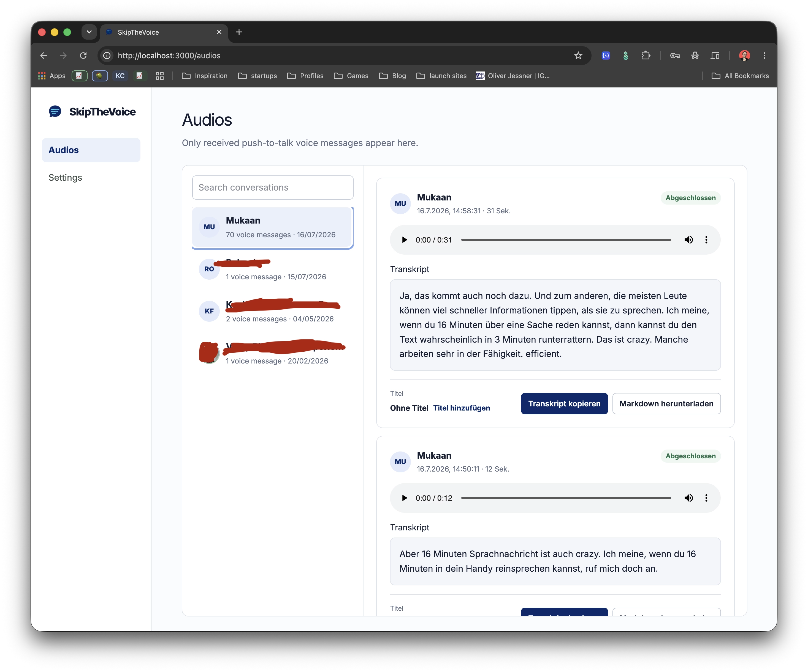
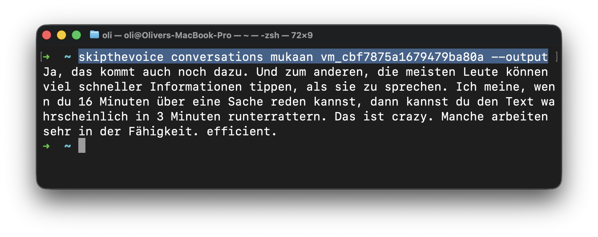

# SkipTheVoice

SkipTheVoice is a local-first, SaaS-ready web application and CLI that imports only received WhatsApp push-to-talk voice messages and transcribes them with a self-hosted OpenAI Whisper worker. It deliberately ignores normal text, non-PTT audio, images, videos, documents, reactions, and every other chat type.

## Preview

### Web app

Browse received voice messages, play the original audio, and work with local transcripts in the browser.



### CLI

Access the same conversations and transcripts directly from the terminal.



## Install SkipTheVoice

Homebrew installs Node.js, FFmpeg, Python, OpenAI Whisper, and SkipTheVoice in one step:

```bash
brew tap oliverjessner/tap
brew install skipthevoice
```

Alternatively, install from npm. Node.js 22+ and Python 3.11–3.14 must already be available; the npm package supplies its media tools and installs the Python packages on the first transcription:

```bash
npm install --global skipthevoice
skipthevoice
```

Running `skipthevoice` starts the local UI at `http://localhost:3000`, opens it in the default browser, and keeps the web server and transcription services running until `Ctrl+C` is pressed. Add a subcommand such as `skipthevoice conversations` or use `skipthevoice --help` for the command-line interface.

Neither installation uses Docker. Application data is stored per user in `~/Library/Application Support/SkipTheVoice` on macOS, `%LOCALAPPDATA%\SkipTheVoice` on Windows, and `${XDG_DATA_HOME:-~/.local/share}/skipthevoice` on Linux. Whisper model files are downloaded by Whisper on first use and then cached locally.

## Architecture

The Next.js App Router application and the Commander CLI call the same TypeScript application services. Repositories enforce `userId` ownership against SQLite/Drizzle. A persistent Node.js runner claims SQLite jobs and consumes progress SSE from a separate FastAPI worker. Baileys credentials, audio, and exports remain outside the public web directory.

```text
Web / CLI -> shared services -> SQLite + storage + Baileys
                              -> persistent Node runner -> FastAPI Whisper worker
```

Timestamps are stored as UTC ISO-8601 strings. SQLite enables foreign keys, WAL, a 5-second busy timeout, and `synchronous=NORMAL` on every application connection.

## Source-development prerequisites

- Node.js 22 or newer (current stable/LTS recommended)
- npm 11 or newer
- Python 3.11–3.14 for broad PyTorch/Whisper compatibility
- FFmpeg and ffprobe on `PATH`

## Local setup

```bash
cp .env.example .env
npm install
npm run whisper:install
```

The workspace installation also builds and links the CLI, so `npx skipthevoice --help` works immediately after `npm install`.

Relative database and storage paths are resolved from the repository root for both workspace processes and the CLI. Set `SKIPTHEVOICE_PROJECT_ROOT` only when embedding the packages in a non-standard layout.

Start the complete local stack with one command:

```bash
npm run dev
```

This starts the web application, persistent transcription runner, and Whisper worker together. The individual `dev:web`, `dev:worker`, and `dev:whisper` scripts remain available for debugging, but running only the web process cannot execute queued transcriptions.

Open `http://localhost:3000`. The final SQLite schema and local development user are created automatically when the app starts; no database preparation command is required. Contacts, conversations, and voice messages always come from connected messenger accounts. To test transcription without loading a model, set `WHISPER_MOCK=true` before starting the Python worker.

## CLI

```bash
npm run cli -- --help
npm run cli -- conversations
npm run cli -- conversations "Muhammed Akman"
npm run cli -- conversations "Muhammed Akman" <voice-message-id> --output
npm run cli -- conversations "Muhammed Akman" <voice-message-id> --markdown
npm run cli -- conversations "Muhammed Akman" <voice-message-id> --download-audio
```

Names are matched case-insensitively; unique partial matches are accepted and ambiguous matches are rejected. A message can be selected by stable ID, optional name, or displayed local timestamp. `--output` and `--markdown` automatically start the bundled local worker and transcription when necessary. Use `--force` for a fresh transcription, `--language <code>` to request a language, and `--json` for machine-readable output. For a packaged CLI, run `npm run pack:cli`; the archive contains the compiled executable, bootstrap schema, and Whisper worker.

Exit codes: `0` success, `1` general error, `2` arguments, `3` authentication/ownership, `4` configuration, `5` messenger, `6` transcription, `7` storage, `8` database, `9` Whisper worker, and `10` cancellation.

## Whisper

The worker lazily keeps one model in memory. CPU works without special setup (`WHISPER_DEVICE=cpu`). CUDA and Apple MPS are optional and validated explicitly; an unsupported requested device fails instead of silently falling back. Model downloads are cached by Whisper. Real processing uses completed 30-second audio chunks as progress samples; partial text contains completed chunks only. ETA uses a throughput exponential moving average (`alpha=0.25`) after four samples, so short messages may finish before an ETA appears.

## Docker

```bash
docker compose up --build
docker compose run --rm app npm run cli -- conversations
```

Named volumes persist SQLite, credentials, audio, exports, and the Whisper model cache. CPU is the default. GPU deployment requires a CUDA-capable PyTorch image and the Compose device reservation described in [deployment.md](docs/deployment.md).

## WhatsApp and privacy

Baileys `@whiskeysockets/baileys@7.0.0-rc13` is pinned from the official WhiskeySockets repository. Baileys is not an official WhatsApp API; automated clients may be restricted and historical sync is best effort. New PTT messages are handled while the process is connected.

Voice messages may contain sensitive information. Users and operators are responsible for consent and applicable law. Audio and transcripts are stored on the operator's infrastructure; self-hosted Whisper avoids an external transcription API but does not remove the operator's data-processing obligations. Protect credentials and backups, configure retention, and remember that deleted data can remain in backups until expiry.

## Quality checks

```bash
npm run lint
npm run typecheck
npm test
npm run whisper:test
npm run build
npm run pack:cli
```

See [architecture](docs/architecture.md), [CLI](docs/cli.md), [distribution](docs/distribution.md), [security](docs/security.md), and [troubleshooting/deployment](docs/deployment.md). Current MVP restrictions: WhatsApp only, received PTT only, local development authentication, one Node runner recommended, best-effort history, no billing/teams/analytics/search, and no message sending.
